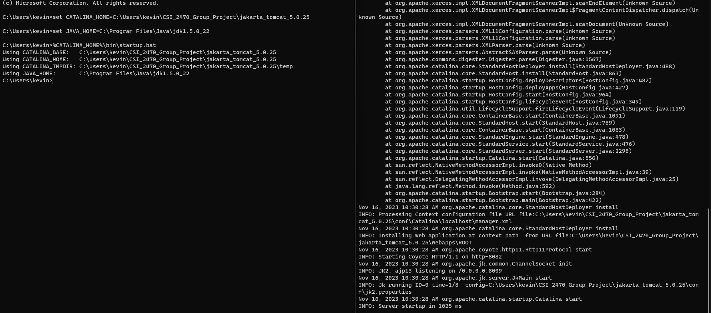
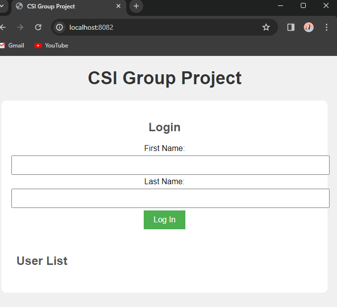
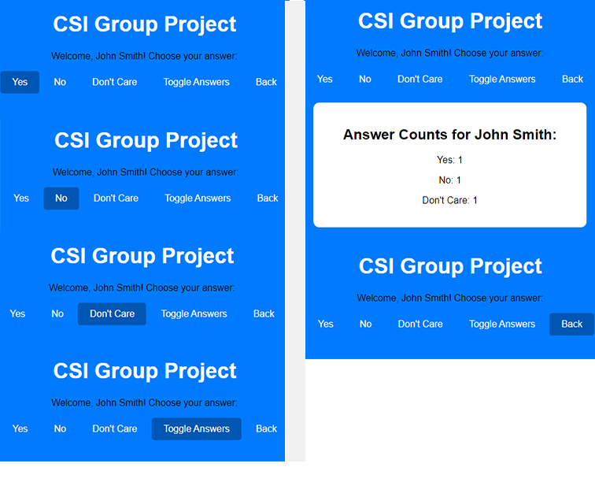
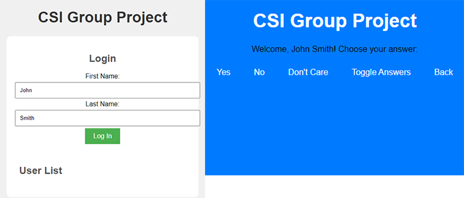
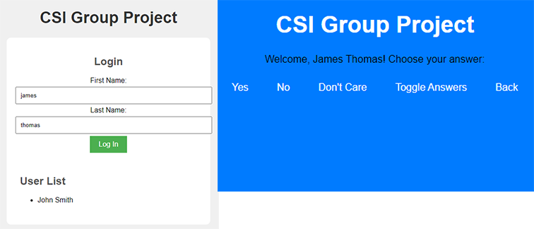

# CSI 2470 Project 

# Directory

- [Directory](#directory)
- [Prerequisites](#prerequisites)
- [How to Run Apache Tomcat](#how_to_run_apache_tomcat)
- [How to Stop the Server](#how_to_stop_the_server)
- [To View Your Local Host](#to_view_your_local_host_please_copy_and_paste_the_following_in_chrome_or_edge)
- [What Needs to Get Done for Readme](#what_needs_to_get_done)

# Prerequisites

## 1. Install JDK 1.5
You'll need Java Development Kit (JDK) version 1.5.0_22 or a compatible version (I used the first .exe installer). You can download it from the [Java SE 5 Archive](https://www.oracle.com/java/technologies/java-archive-javase5-downloads.html).

## Clone Github Repository 
**Note:** The file must be cloned to the C:\ drive.
~~~sh
git clone https://github.com/cyberdataint/CSI_2470_Group_Project.git
~~~

### 2. Set Environment Variables

### Configure CATALINA_HOME:
Open a Command Prompt and run the following command, replacing **C:\path\to\tomcat** with your Apache Tomcat installation 

~~~sh
set CATALINA_HOME=C:\Path**\To**\CSI_2470_Group_Project\jakarta_tomcat_5.0.25
~~~

### Set JAVA_HOME:

Similarly, set the JAVA_HOME environment variable to your JDK installation directory. Here's an example:

~~~sh
set JAVA_HOME=C:\Program Files\Java\jdk1.5.0_22
~~~

### How_to_Run_Apache_Tomcat

To start the Apache Tomcat server, open a Command Prompt and execute the following command:

~~~
%CATALINA_HOME%\bin\startup.bat
~~~

### How_to_Stop_the_Server
To gracefully shut down the Apache Tomcat server, open a Command Prompt and execute the following command:

~~~
%CATALINA_HOME%\bin\shutdown.bat
~~~

With these steps, you should be able to set up and run Apache Tomcat using JDK 1.5.0_22 on your Windows system.

### To_view_your_local_host_please_copy_and_paste_the_following_in_Chrome_or_Edge 

~~~
http://localhost:8082/
~~~

# Submission 

### 1. Description of the Overall Program Design

#### Purpose:
The project involves the development of a web application using HTML and JavaScript, hosted on a Tomcat Apache server. The application features a secure login page that captures and retains user responses. Notably, the answers are stored on cookies, enhancing privacy and ensuring that the data is not directly saved on the website. To further optimize resource usage, answers are temporarily stored via session storage, guaranteeing that the information persists only throughout the active session. A unique feature of the code is the automatic capitalization of the first initials in both the first and last names, rectifying instances where the names are not initially entered with capital letters. This comprehensive implementation aims to provide a seamless and secure user experience while maintaining data integrity and privacy.

### 2. Logical Flow Diagram (UML)

#### Purpose:
A Unified Modeling Language (UML) diagram illustrates the logical flow structure of the software. This high-level diagram provides an overview of the system's components and their interactions.

### 3. Logical Flow Diagrams for Methods, Functions, and Procedures

#### Purpose:
Individual UML diagrams are included for each method, function, and procedure defined in the software. These diagrams offer a detailed look at the internal logic and flow of each component.

### 4. Files/Database Section

•	In C:\Users\Owner\CSI_2470_Group_Project\jakarta_tomcat_5.0.25 we have our server.

•	We start and stop the server using the bin file for example, C:\Users\Owner\CSI_2470_Group_Project\jakarta_tomcat_5.0.25\bin\startup  C:\Users\Owner\CSI_2470_Group_Project\jakarta_tomcat_5.0.25\bin\shutdown

•	Our website and subsequent code that displays to the user is stored in the Jakarta_tomcat_5.0.25 folder under web apps in the ROOT folder at the file path C:\Users\Owner\CSI_2470_Group_Project\jakarta_tomcat_5.0.25\webapps\ROOT

•	The ROOT folder houses all our files for the user interface of the project along with the subsequent scripts to run them. For example, our login webpage is stored in the file path of C:\Users\Owner\CSI_2470_Group_Project\jakarta_tomcat_5.0.25\webapps\ROOT\login.html
and our answer webpage is stored at C:\Users\Owner\CSI_2470_Group_Project\jakarta_tomcat_5.0.25\webapps\ROOT\answer.html

• Login page for the webserver:
*

• Answers page for the webserver:
*

### 5. Compile/Execution Section

#### Prerequisites:
### 1. An installation of **JDK 1.5.0_22**
a.  Download can be found at [Oracle](https://www.oracle.com/java/technologies/java-archive-javase5-downloads.html) (Account required)
### 2. The file must be cloned to the **C:\ Drive**
a. This can simply be done by installing **Github Desktop** and selecting “File” -> “Clone Repository” -> Select File and Set URL path to (https://github.com/cyberdataint/CSI_2470_Group_Project.git) -> “Clone”
i. Download can be found [here](https://github.com/cyberdataint/CSI_2470_Group_Project.git)
### 3. Environment Variables must be set 
a. Open the **Command Prompt** to configure **CATALINA_HOME** and set **JAVA_HOME**
i. To configure CATALINE_HOME, enter the following command into the **Command Prompt:** 
~~~
“set CATALINA_HOME=C:\Path**\To**\CSI_2470_Group_Project\jakarta_tomcat_5.0.25”
~~~
, replacing “Path**\To**” with the path to your tomcat installation 
1. A shortcut to enter the path is to find your tomcat installation (specifically the “jakarta_tomcat_5.0.25” folder) and RMB -> “Copy as Path” -> CTRL + V after “CATALINA_HOME="
a. Make sure to remove the quotation marks if you decide to use this method
ii. To set **JAVA_HOME** enter the following command into the **Command Prompt:**
~~~
“set JAVA_HOME=C:\Program Files\Java\jdk1.5.0_22”
~~~
1. Double check your installation to confirm the **“Java”** folder is located in your **“Program Files”** folder, if not, check your **“Program Files (x86)”** folder, if you find the **“Java”** folder there, enter “ (x86)” directly after “Program Files” in the previous command
a. If you don't find the **“Java”** folder in either, recheck your installation of **JDK 1.5.0.22** from **Step 1** and use **Step 3.a.i.1** to enter the correct path

### Running and Stopping the Server:
1. To start the server, open the **Command Prompt** and enter the following command after completing the prerequisites:
   
    ~~~
    “%CATALINA_HOME%\bin\startup.bat”
    ~~~
    
a. If working correctly, a second terminal should open up with a line at the bottom detailing the server startup time

2.  To stop the server, use the **Command Prompt** to enter the following command: 

    ~~~
    “%CATALINA_HOME%\bin\shutdown.bat”
    ~~~
    
a. Alternatively, you can close the terminal to shut down the server
### Accessing the Web Page: 
1. Open a new browser window and enter the following address into the search bar:
   
    ~~~
    http://localhost:8082
    ~~~

a. If everything is set up correctly, you should see a prompt for your first and last name
3. Follow the instructions on the web page to create a  submission

### 6. Test Cases Section

#### Purpose:
This section outlines the tests conducted on the program to ensure its correctness. It includes a description of successful test cases and highlights any known issues or scenarios where the program may not function correctly.

#### Test conducted
* Executing Server
* Connecting to Local Host
* Test All Application Buttons
* Test to See if Button Presses Appear in Results
* Navigate to back to see if user appears in "User List"
* Attempt login will all lowercase letters to see if the name is made proper.

### 7. Screenshots of Execution Sessions

#### Purpose:
Visual representation is provided through screenshots of execution sessions, showcasing the program's behavior with both valid and invalid inputs. This offers a practical understanding of the software's performance.

#### Startup of program in command prompt.  Run Successful

#### Test of the local host url. Run Successful

#### Test of all buttons after login. Run Successful

#### Valid test of user implementing first and last name capitalized. Run Successful

#### Invalid test of not capitalizing name, yet the program corrects it and capitalizes first and last name. 
#### Also shown is past test name in "User List." Run Successful

## Conclusion

This documentation serves as a comprehensive guide, enabling users to understand, test, and execute the program effectively. Feedback and contributions are welcomed for continuous improvement.
